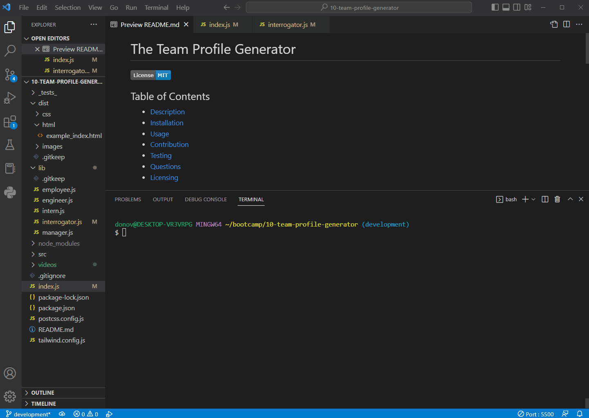
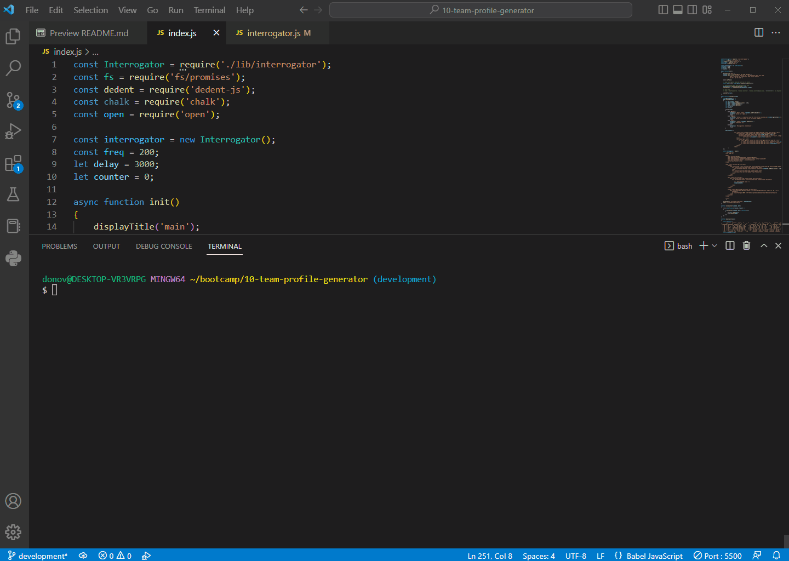

# The Team Profile Generator

  
## Table of Contents

* [Description](#description)
* [Installation](#installation)
* [Usage](#usage)
* [Contribution](#contribution)
* [Testing](#testing)
* [Questions](#questions)
* [Licensing](#licensing)

## Description

Communication is critical to a teams success and creating an updated recall roster is the first step in ensuring all contact information is readily available. Typically this information has been written, copied, populated in a spreadsheet, and then disseminated. Now, The Team Profile Generator will handle gathering team info, populate an html document, and allow you to host the contact info out to the rest of your team.

## Installation

This is a terminal based tool using Node.js. Once you have installed Node.js you will need to install the following modules:

- inquirer v8.2.5
- email-validator
- jest
- dedent-js
- chalk
- open
- phone
- tailwindcss
- tw-elements

## Usage

To start The Team Profile Generator you need to have access to a cmd prompt or terminal.
Navigate to the generators root directory and run the command **node index.js**.
From here you will be prompted with a series of questions about you and your team.
After all questions are answered the generator will consolidate the information and build and present an html page containing your team roster and their contact information.
 
  

        
  

 

## Contribution

Follow the "fork-and-pull" Git workflow.

  1. **Fork** the repo on GitHub
  2. **Clone** the project to your own machine
  3. **Commit** changes to your own branch
  4. **Push** your work back up to your fork
  5. Submit a **Pull request** so that we can review your changes

NOTE: Be sure to merge the latest from "upstream" before making a pull request!

## Testing

Testing is conducted using Jest and all test scripts are located in the **_tests_** folder.
The test will verify that each class script properly outputs an instantiated Class object.
To run the tests enter the command **npm test** while in the root directory of The Team Profile Generator.
 
  

        
  

 

## Questions

Feel free to contact me with any questions or comments:  
<donovan.courtney@gmail.com>  
<https://github.com/decourtney>

## Licensing

Code and Docs released under [MIT License](https://choosealicense.com/licenses/mit/).
